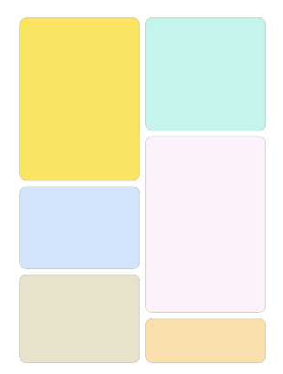

# PinDCO: Whole-Page Aware Dynamic Creative Optimization at Scale (Ads, Pinterest)

## Paper Link
https://arxiv.org/abs/2609.11943

## Pinterest logic (read this first)

**Home** is a waterfall of cards in vertical columns: fixed width, **variable height**. A tall card pushes everything below it down. Ads sit in that same grid, mixed with organic pins.



One advertiser (an **ad**) can have many pictures / titles / layouts. Each picture is a **creative**. Generative models made that pile huge. **DCO** (dynamic creative optimization) = pick *which* picture this user sees for that ad. Not “which advertiser wins the auction” — that is a separate ranking model.

The trap: a tall lifestyle shot can raise **this ad’s** clicks and still wreck the page, because it steals pixels from the next pin. Pinterest therefore tracks a **whole-page** metric (successful session: click / save / social on ads *or* organic), not only ad CTR.

```text
Same sofa ad, two creatives:
  short product card  → more room below for other pins
  tall hero photo     → this ad looks great, column is jammed
```

## One-Line Summary
Score the *extra* click from this creative (not the whole ad), then shrink tall cards unless that extra click is worth the pixels they steal from the rest of the page.

## Core Problem
Gen-AI exploded the creative catalog. You cannot run every variant through the heavy ad ranker. And a model that only maximizes **this ad’s** CTR will pick the tall winner: more pixels, more chance this ad is clicked, fewer impressions (and clicks) for everything below it.

That cannibalization is **not** fixed by editing labels. CCFN still trains on “did they click the creative we showed?” Two different knobs:

```text
Tall-image / whole-page problem  →  PAM at serve time
                                  tax height so a tall card must earn extra click
                                  to beat a short one. They do not relabel
                                  “this click was stolen from a neighbor.”

Greedy logs never show losers    →  ε-greedy exploration
                                  a different problem (cold-start / selection bias).
                                  Randomly serve a non-winner so the next CCFN
                                  can learn. Not a correction for tallness.
```

If they only did exploration, the model would still love tall cards, because those clicks are real. The page fix is: **be careful showing a tall image** (unless $O$ is high enough to pay the tax).

## Terminology

| Symbol | Plain meaning |
|---|---|
| Ad | The advertiser / campaign. Ranked by a big model that does not see creative variants. |
| Creative $c_i$ | One image / title / layout for that ad. |
| CCFN | Creative Component Fusion Network: towers per component (image, title, layout), then fused. |
| $O$ | CCFN score: predicted **delta** on top of the ad-level logit. |
| $ar_{rel}$ | Candidate aspect ratio / original aspect ratio (taller $\Rightarrow$ bigger). |
| $P(ar_{rel})$ | Size penalty in $[0,1]$. |
| $S$ | Final score after the penalty. |
| $k$ | How hard PAM punishes tall cards. Tuned on offline replay. |
| PAM | Pixel-aware Adjustment Module. |
| $\varepsilon$-greedy | With probability $\varepsilon$, do **not** pick the top creative; pick a random other one, so logs stay less biased. |
| Successful session | Whole-page “the session worked” (ads **and** organic). |

## Method
Run DCO **in parallel** with ad ranking so it does not add end-to-end latency. Because the winning ad is unknown yet, you must score creatives for *all* ad candidates — hence a cheap local **pre-selection** prune, then CCFN on a dedicated cluster (sharded cache + dynamic batching).

CCFN does not relearn “this advertiser is popular.” It predicts only the **delta** vs the ad-level score. Towers get different dropout so the image tower does not overfit while the layout tower is still underfitting. Supervise the **sum** of ad logit + creative delta with the click.

PAM then taxes height:

$$
S = O \cdot P(ar_{rel}), \qquad P(ar_{rel}) = \mathrm{clip}\left(1 - \tanh\left(k(ar_{rel}-1)\right), 0, 1\right).
$$

A taller card must beat that tax. $k$ is chosen so replay hits a target average aspect ratio.

Finally, do not always serve $\arg\max S$. $\varepsilon$-greedy explores:

$$
\Pr(W=c_i) =
\begin{cases}
1-\varepsilon & \text{if } c_i = c^{\ast} \\
\varepsilon/(n-1) & \text{otherwise.}
\end{cases}
$$

Those random serves are the less-biased labels for the next CCFN.

```text
retrieve ads
  → expand each ad into creatives (KV store)
  → cheap local prune
  → CCFN delta (parallel with ad ranker)
  → PAM height tax
  → ε-greedy sometimes overrides the winner
```

## Concrete Example
Same sofa campaign. Two users.

```text
Alex  high shopping intent, query interest = furniture.
      CCFN: multi-image product layout  O high
      PAM:  layout is short  → tax ≈ 1  → SHOW product card.

Sam   browsing architecture for inspiration, low shopping intent.
      CCFN: tall lifestyle hero  O a bit higher
      PAM:  ar_rel >> 1  → tax small  → short aesthetic card wins
            unless the hero’s extra click really pays for the pixels.
```

Without PAM, Lightweight-only and Peri-CR both raise ad CTR and **hurt** successful session (taller winners). With PAM, most of the CTR is kept and the page does not collapse.

Ask analog: do not put a full-bleed pin in Ask results just because it is pretty if it shoves the next three answers off screen. Spend pixels only when the marginal engagement covers the cannibalization.

## Results
Launched on Pinterest Ads. Online vs no-creative-ranking (global rule):

```text
                    Ad CTR    Successful session
Lightweight-only    +1.49%    −0.24%
Peri-CR             +1.70%    −0.12%
PinDCO              +3.09%    +0.04%
```

PAM on multi-variant ads: CTR +9.8% without it vs +9.5% with it; aspect-ratio inflation 7.21% → 5.22%. Serving: drop dynamic batching and P99 latency +87%. Offline CCFN lifts are tiny (PR-AUC +0.171%) — the live win is the **system** (delta head + PAM + exploration + prune), not the AUC table.

## Bottom Line
Predict the creative’s extra click on top of the ad, then tax height so a pretty tall card cannot win by stealing the rest of the page. Keep a slice of random serves or the next model will only ever see winners.
