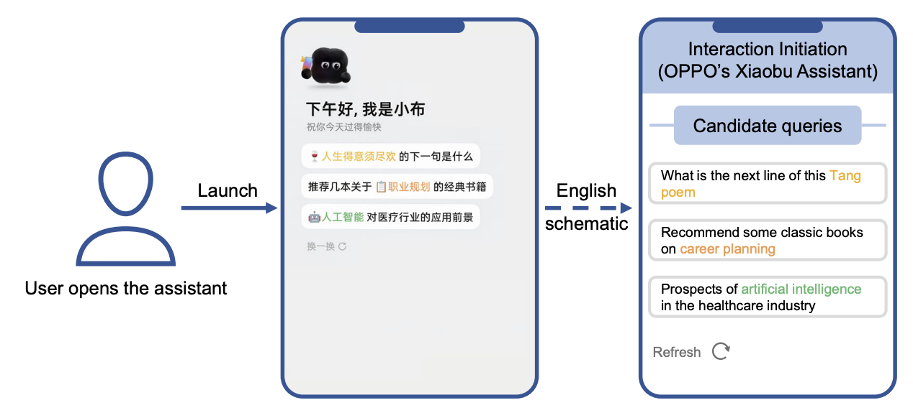

# InitGen: Candidate Generation for Interaction Initiation in Intelligent Assistants (Xiaobu Assistant, OPPO)

## Paper Link
https://arxiv.org/abs/2609.11953

## Xiaobu logic (read this first)

**Xiaobu** is the on-device assistant (think the suggestion chips Siri / Gemini show **before you type**). You open it; three sentences appear; you tap one or ignore them. That opening screen is **interaction initiation**.



A generator writes **five** candidate queries. A downstream filter + ranker shows **at most three**. You only ever see the three. So:

```text
Generator wrote:   A B C D E
Ranker showed:     A C E
You tapped:        C
```

You **cannot** say D and B were bad — they never appeared. You **cannot** say A and E were bad — maybe they were #3 on a small phone. A click on C also does not mean A was worse than C. The only honest label is about the **whole set**: someone clicked something, or nobody did.

## One-Line Summary
Generate the five suggestions as one blob, label that blob with “did anyone click,” and up-weight sets the ranker already trusted — do not invent per-query likes/dislikes from a partial screen.

## Core Problem
At open, there is **no current query**. History is a long-term prior; today’s intent is unknown. Latency budget is **180 ms** (users can refresh). If you generate five independent sentences you get duplicates and the ranker has nothing left to fill the slots.

The labeling problem is worse: feedback is **partial and delayed**. Query-level “clicked = good, shown-not-clicked = bad” is a lie. DPO on those fake pairs made their 1.5B model dump mixed Chinese/English until max length.

## Terminology

| Symbol | Plain meaning |
|---|---|
| $\mathcal{Q}=\{q_1,\ldots,q_K\}$ | The $K$ queries generated in **one** call ($K=5$). |
| $\mathcal{E}(\mathcal{Q})$ | The subset the UI actually showed ($\le 3$). |
| $y(\mathcal{Q})$ | $1$ if **any** shown query was clicked; $0$ if all shown queries were ignored. Missing if nothing was shown. |
| SFT | Supervised fine-tune: copy historical five-line blobs. Teaches format. No click weights yet. |
| KTO | Alignment that needs only desirable / undesirable completions, not pairwise prefs. |
| $w_u$ | Weight for that user's **activity bucket** (not a personal ID weight). High-CTR buckets get $w_u < 1$. |
| $s_q$ | Downstream ranker score on a **shown** query. |
| $\bar{s}(\mathcal{Q})$ | Mean $s_q$ over shown queries. |
| $w_r$ | Ranking-based weight: trust the click/no-click more when the ranker liked the shown set. |
| $w(\mathcal{Q})$ | Combined sample weight. |
| WKTO | KTO with those weights. |
| Rolling window | Daily offline update on **recent** logs only; no extra online latency. |

## Method
One prompt: history + coarse city + profile blurb. One completion: five lines. Downstream still filters/ranks. SFT teaches the newline format; then KTO on the **serialized set**.

Keep a training row only if something was shown. Label the set, not the lines:

$$
y(\mathcal{Q}) =
\begin{cases}
1 & \text{at least one shown query clicked} \\
0 & \text{all shown queries ignored.}
\end{cases}
$$

Power users dominate clicks. Weight the opposite way:

$$
w_u = \sigma(\mathrm{CTR}_{avg} - \mathrm{CTR}_{u}) + 0.5.
$$

Ranker score is **not** a reward and **not** a label. It only says how much to trust $y$:

$$
\bar{s}(\mathcal{Q}) = \frac{1}{|\mathcal{E}(\mathcal{Q})|}\sum_{q \in \mathcal{E}(\mathcal{Q})} s_q, \qquad
w_r(\mathcal{Q}) = \bar{s}(\mathcal{Q}) + c, \qquad
w(\mathcal{Q}) = \sqrt{w_u \cdot w_r(\mathcal{Q})}.
$$

$$
\mathcal{L}_{WKTO} = \sum_{\mathcal{Q} \in \mathcal{D}} w(\mathcal{Q})\,\mathcal{L}_{KTO}(\mathcal{Q}, y(\mathcal{Q})).
$$

Clicks are rare, so they **downsample** $y=0$ to 1:1 or the 1.5B model degenerates. Daily rolling WKTO on a recent window; SFT is not rerun. Serve Qwen2.5-1.5B (Qwen3-1.7B missed 180 ms).

```text
open assistant
  → one 180 ms call → 5 queries
  → filter / rank → ≤3 chips
  → click on the set (or not)
  → tonight: WKTO on recent sets only
```


## Concrete Example
History has Shenzhen restaurants and photography. Phone is in **Wuhan** today.

```text
No context (history only):
  “best restaurants in Shenzhen”
  “Dongguan weekend trip”
  → stale geography; ranker may still show them; user ignores → y = 0

With city + profile:
  “Wuhan indoor if it rains”
  “photography spots in Wuhan”
  “AI photo editing tips”
  → one chip clicked → y = 1 for the whole five-line blob
```

$w_r$ is high if the ranker already scored those chips well — the click (or the ignore) is then a stronger set-level lesson. $w_u$ is high if this user is in a low-CTR bucket, so power-user snacks do not own the gradient.

Ask analog: if Ask generates five follow-up chips and CFS only shows three, do not treat the two buried chips as policy failures. Label the **batch**. Do not treat unscrolled chips as negatives.

## Results
Online A/B, same downstream, same traffic, Xiaobu (~150M MAU). Backbone Qwen2.5-1.5B vs production SFT+KTO (also set-level):

```text
              exposure     clicks      CTR
baseline      3.81M        36k         0.95%
InitGen       4.49M        72k         1.61%
relative      +17.9%       +99.5%      +69.1%
```

Staged pairwise ablations (each vs its predecessor, so **do not add** the percents):

```text
+ context           +11.6% CTR
+ w_u               +5.7%
+ w_r               +19.6%   ← biggest slice
+ daily rolling     +20.1%
```

$w_u$ helps **low-CTR** users (+9.0%) and barely moves high-CTR (~+1%). Latency ~150 ms, peak >12k query-sets/min on 20×A100.

## Bottom Line
When a filter sits between the model and the user, label the **set that was generated**, not the lines nobody saw. Use the ranker to **weight** that set-level yes/no. Do not pretend unclicked chips are negatives.
